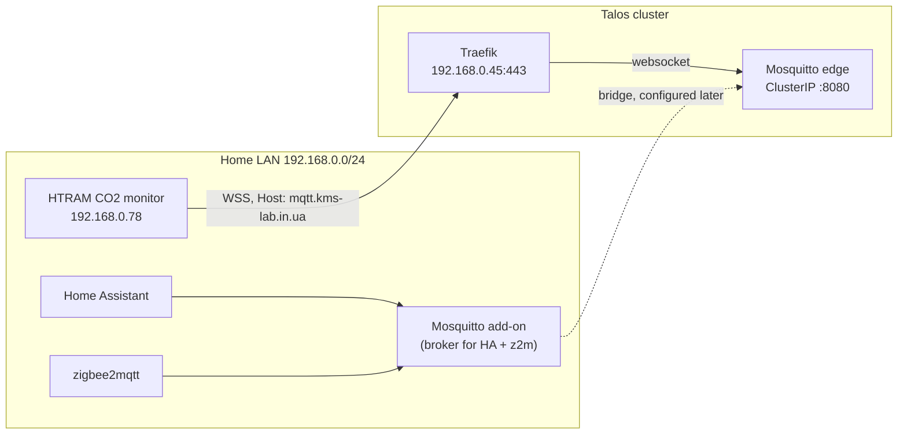

# ADR 020: Edge MQTT Broker for the HTRAM CO2 Monitor

## Status

Accepted — deployed and carrying telemetry end to end.

## Context

A Honeywell HTRAM CO2 monitor was reverse-engineered to publish telemetry to a
self-hosted broker after the vendor's cloud shut down. It imposes two
requirements that cannot be negotiated, because both are compiled into its
firmware:

- MQTT over WebSocket Secure on **port 443**, with no alternative port.
- A username of the form `1617:V1.00 :<random>`, with the password being
  `sha256` of that same string. The random component changes on every
  connection, so no password file can ever match it.

**The official Mosquitto add-on cannot serve this device.** Its config
template loads `auth_plugin go-auth.so` above the `include_dir` directive for
the customize folder, and Mosquitto refuses to start when
`per_listener_settings` appears after any security setting:

```
Error: per_listener_settings must be set before any other security settings.
```

`allow_anonymous true` does not help either: anonymous mode applies only to
clients that send no username at all, and this device sends one. Both
behaviours were verified against `eclipse-mosquitto:2` rather than inferred
from documentation.

**Home Assistant supports exactly one broker.** The core MQTT integration
declares `"single_config_entry": true`, so the device's topics must eventually
reach whichever broker Home Assistant already uses.

**The add-on's credentials are managed for the user.** Home Assistant
generates and assigns the broker username and password itself and keeps them
secret; zigbee2mqtt is configured once against the same add-on. Moving both
onto a different broker would mean taking over that credential management by
hand, for no gain related to this device.

## Decision

Run a second, small Mosquitto in the cluster that serves **only** this device.
The add-on remains the broker for Home Assistant and zigbee2mqtt, and neither
is reconfigured. The two are joined by a Mosquitto bridge configured **on the
add-on side**, in its customize folder, as a separate later step.

Putting the bridge there rather than here keeps both sides free of secrets:
the add-on dials out to an anonymous listener, so no password is stored,
rotated, or read from Bitwarden anywhere.

The device speaks MQTT over WebSocket — an ordinary HTTP Upgrade — and sends a
correct `Host` header mirroring whatever address it was provisioned with:

```
GET / HTTP/1.1
Host: mqtt.kms-lab.in.ua:443
Upgrade: websocket
Sec-WebSocket-Protocol: mqtt
User-Agent: ESP32 Websocket Client
```

That is exactly what a reverse proxy needs, so this is a normal Traefik
ingress like every other service — see [[002-networking-and-ingress]]. Traefik
terminates TLS on its existing `*.kms-lab.in.ua` certificate and the broker
listens for plain WebSocket inside the cluster. No MetalLB address is
consumed, and no certificate is managed for this workload.

Two listeners, no password file anywhere:

| Listener | Exposure | Protocol | Clients |
| --- | --- | --- | --- |
| 8080 | Traefik ingress, TLS terminated upstream | WebSocket | HTRAM CO2 monitors |
| 1883 | MetalLB `192.168.0.48`, LAN only | MQTT | the add-on's bridge |

The second listener exists because **Mosquitto bridges speak only plain
MQTT**. Pointed at a WebSocket listener, a bridge sends a raw CONNECT into
the socket and the far side reports `bad socket read/write`; verified against
`eclipse-mosquitto:2`. The add-on therefore cannot reach the WebSocket
endpoint, and Traefik cannot carry the bridge either, since it parses HTTP.

Both listeners are anonymous and share one ACL. That is not a widening of
exposure: the WebSocket endpoint is already anonymous and already reachable
from the LAN through Traefik, so anyone who could read `C/#` on one can read
it on the other. What it buys is a bridge with **no credential at all** —
verified: a bridge configured with `remote_username ha-bridge` and no password
connects and carries telemetry.

## Access control

```
pattern readwrite C/%c
pattern readwrite D/%c

user ha-bridge
topic readwrite C/#
topic readwrite D/#
```

`pattern` rather than `topic` is load-bearing. `topic` lines placed before the
first `user` directive apply only to clients that send no username, so the
device would fall outside them and the broker would silently drop its
telemetry. `%c` substitutes the client id, which for this device is its serial
number, so each device is confined to its own pair of topics.

The `ha-bridge` section exists for the bridge that will be configured on the
add-on side. It needs a recognisable username to widen its subscription to
`C/#`, but no password: the listener accepts any username. Verified against
`eclipse-mosquitto:2` — a client publishing as `RM1221412257` reaches only its
own topic, while `ha-bridge` subscribed to `C/#` receives it.

## Topology



## Addressing the device

The device passes whatever it stores straight to `AT+MQTTCONN` as the host
argument, after stripping the first six characters — hence the mandatory
six-character scheme prefix such as `tcp://`. ESP-AT resolves hostnames there,
and the vendor's own cloud endpoint was a hostname, so a name works as well as
an address.

A name is required here anyway, because Traefik routes on it. It is also
preferable operationally: reprovisioning the device requires a physical button
press to open its BLE advertising window, so the address should be changeable
without touching the hardware.

No DNS work was needed. The public zone answers `*.kms-lab.in.ua` with
`10.9.0.1`, the WireGuard hub, and that address is reachable from the home
network: a WebSocket-Secure session opened against it from a LAN host reached
Traefik and then the broker. Whichever resolver the device receives over DHCP,
the wildcard answer routes.

## Exposure

The broker's listener is anonymous, so its reachability matters. In the
`kms-lab.in.ua` zone only six named records are CNAMEs through the Cloudflare
tunnel; `mqtt` is not among them, and the wildcard A record is unproxied and
points at a private address. The plain-MQTT listener has no name at all and
lives on a LAN address. The listener is therefore reachable from the home
LAN and from VPN clients, and not from the internet.

## Config file ownership

Mosquitto reads `mosquitto.conf` while still running as root, then drops
privileges to the `mosquitto` user, and only afterwards opens `acl_file`. A
ConfigMap mount stays owned by `root:root`, so the ACL is unreadable by then
and the broker exits:

```
Error: Unable to open acl_file "/mosquitto/config/acl".
```

`fsGroup` did not change ownership of the mount in this cluster, so the
config is instead staged by an init container that copies it into an
`emptyDir` and sets `mosquitto:mosquitto 0600`. That also clears Mosquitto
2.1's warnings that world-readable config files "will refuse to load" in
future versions.

`per_listener_settings` is deliberately absent: with a single listener the
global security settings are that listener's settings, and the option is
deprecated in 2.1, emitting two warnings for no benefit.

## Consequences

**Nothing that currently works is touched.** Home Assistant and zigbee2mqtt
keep their add-on and its managed credentials. Zigbee does not acquire a
dependency on the cluster or on the network path to it.

**No secrets in this workload.** No Bitwarden entry, no certificate, no
password file.

**Telemetry depends on Traefik.** Everything else already does, and the
alternative — a dedicated MetalLB address with its own certificate — spends
one of five pool addresses and adds a certificate to manage.

**Two brokers and a bridge become part of the topology.** This is the cost of
the decision. The bridge is a native Mosquitto feature rather than a separate
process, but it is one more thing to remember when MQTT misbehaves.

**Rollback is deleting a workload.** Nothing outside the cluster changes until
the bridge step.

**Consolidation stays available.** If the edge broker proves reliable and the
bridge becomes an annoyance, moving Home Assistant and zigbee2mqtt onto it is
a later, independent decision — at the price of managing their credentials by
hand.

## Verification

The ingress path was exercised from a LAN host with a client reproducing the
device's exact handshake — same `Host` header, same `Sec-WebSocket-Protocol`,
same username format and `sha256` password:

```
TLS: TLSv1.2 ECDHE-RSA-AES128-GCM-SHA256
HTTP/1.1 101 Switching Protocols
CONNACK: 20020000  -> accepted
```

TLS 1.2 matters: the device negotiates 1.2 and nothing newer, and Traefik
accepts it.

The full chain was then observed live: the device published to
`C/RM1221412257` on the edge broker and the same payload appeared, at the same
second, on the add-on's broker in MQTT Explorer. Bridge, ACL, ingress and
device provisioning all hold together. The ACL was confirmed with two simultaneous sessions — a client
subscribed to `C/#` as `ha-bridge` received the device's publish to
`C/RM1221412257` and did not receive its publish to `C/RM9999999999`.

## Steps

1. Deploy this workload and add a LAN DNS record for `mqtt.kms-lab.in.ua`
   pointing at Traefik.
2. Reprovision the device over BLE to `tcp://mqtt.kms-lab.in.ua` and confirm
   telemetry arrives on `C/<serial>`.
3. Add the bridge to the add-on's customize folder, connecting to
   `192.168.0.48:1883` as user `ha-bridge`, with `topic C/# in` and
   `topic D/# out`. The address is used rather than the hostname because
   `mqtt.kms-lab.in.ua` resolves to the WireGuard hub, which fronts Traefik
   on 443 and knows nothing of port 1883.
