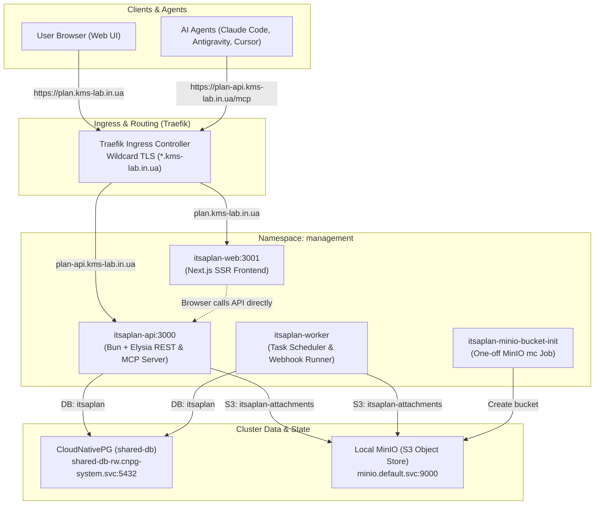

# 024 Deploy "It's a Plan" AI-Native Issue Tracker

**Status:** Implemented
**Date:** 2026-09-25

## Context

We require a central, self-hosted issue tracker and project management platform to coordinate work between human engineers and autonomous AI coding agents (such as Antigravity, Claude Code, and Cursor).

Previous alternatives like Plane or Jira have high memory footprints (2.5 GB to 4+ GB of RAM) and lack native agent-first primitives. **It's a Plan** (`croffasia/itsaplan`) is a modern, lightweight platform built on Bun, Elysia, Drizzle ORM, and Next.js that runs in ~400–600 MB of RAM across all pods.

Crucially, It's a Plan treats AI agents as first-class team members with dedicated `@username` accounts, permission sets, autonomous task lifecycles, and a native Model Context Protocol (MCP) server endpoint (`/mcp`).

## Architecture & Topology

## Architectural Decisions & Environment Adaptations

1. **Dual Ingress Hostnames (`plan` and `plan-api`):**
   - The Elysia backend relies on `better-auth` mounted at `/api/auth/*`. Better-auth does not support running behind a subpath prefix (e.g. `/api`) on the same domain as the frontend without breaking path resolution.
   - We separate the services into two distinct single-level subdomains:
     - `plan.kms-lab.in.ua` for Next.js Web UI (`itsaplan-web`, port 3001).
     - `plan-api.kms-lab.in.ua` for Elysia API & MCP server (`itsaplan-api`, port 3000).
   - Single-level subdomains are natively protected by our cluster-wide Let's Encrypt wildcard certificate (`*.kms-lab.in.ua`) and Cloudflare Universal SSL (which does not support multi-level subdomains like `api.plan.kms-lab.in.ua` on the free tier).
   - `COOKIE_DOMAIN` is set to `.kms-lab.in.ua` to allow seamless session sharing between `plan` and `plan-api`.

2. **CloudNativePG (`shared-db`) Integration:**
   - Dedicated database `itsaplan` and user `itsaplan` are provisioned declaratively in `cnpg-system` using `DatabaseRole` and `Database` custom resources.
   - Connection URL: `postgresql://itsaplan:<PASSWORD>@shared-db-rw.cnpg-system.svc.cluster.local:5432/itsaplan`.
   - Database migrations run automatically during `itsaplan-api` container initialization.
   - `SKIP_PRE_MIGRATION_BACKUP` is set to `"1"` because the application image bundles PostgreSQL 17 `pg_dump` tools while our CloudNativePG cluster is PostgreSQL 18. Continuous database protection and WAL archiving are already managed by CNPG at the cluster level.

3. **Local Object Storage (MinIO):**
   - Attachments are stored in the cluster's high-performance local MinIO (`http://minio.default.svc.cluster.local:9000`) in bucket `itsaplan-attachments`.
   - `S3_FORCE_PATH_STYLE: "true"` is explicitly configured for MinIO compatibility.
   - A declarative one-off `kubernetes_job_v1` ensures the `itsaplan-attachments` bucket exists prior to application startup.

4. **Multi-Arch Container Images from GHCR:**
   - Official images are pulled from GitHub Container Registry (`ghcr.io/croffasia/itsaplan-*`), pinned to release tag `1.1.0`.
   - Images provide native multi-architecture support (`linux/amd64` for Proxmox workers and `linux/arm64` for OCI nodes).

5. **Resource Efficiency & Omission of `itsaplan-bot`:**
   - In `croffasia/itsaplan`, agent schedulers and background tasks are embedded in `itsaplan-worker` (using `croner`).
   - The `itsaplan-bot` container is exclusively a Telegram bot integration (`grammy`). We disable `bot` (`bot.enabled: false`) to eliminate redundant resource consumption.

## Consequences

- **Low Resource Usage:** Entire tracker runs under ~500 MB RAM across all 3 containers.
- **Agent Integration:** AI agents can connect directly via HTTP/SSE MCP at `https://plan-api.kms-lab.in.ua/mcp` using API keys (`x-api-key`).
- **Autonomous & Safe:** Fully decoupled from external cloud billing; data stays within local Ceph/Longhorn and local CNPG.
