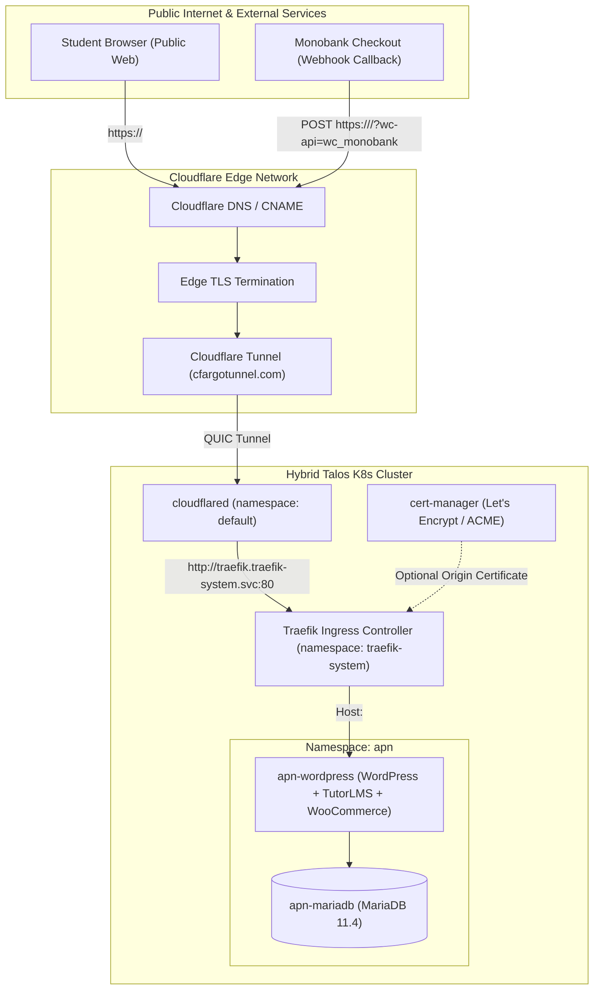

# 025 Production Public Ingress, TLS, and DNS for APN Educational Platform

**Status:** Proposed / Awaiting Public Domain
**Date:** 2026-09-22

## Context

The **APN** educational platform (`WordPress 6.7 + WooCommerce + TutorLMS + MariaDB`) is deployed in the `apn` namespace. Currently, the platform is restricted to internal and VPN access under `apn.kms-lab.in.ua` via the local Traefik ingress controller on MetalLB IP `192.168.0.45`.

To launch public courses and process automated student enrollments, APN requires:
1. A production public domain accessible over the Internet without VPN.
2. Production TLS termination with valid, trusted certificates (Let's Encrypt / Cloudflare SSL).
3. Public ingress routing to the `apn-wordpress` pod in the cluster.
4. Seamless delivery of **Monobank Checkout** asynchronous payment webhooks (`/?wc-api=wc_monobank`).

Per project security guidelines ([`APN/GEMINI.md`](file:///home/max/APN/GEMINI.md)), live payment processing is strictly prohibited on test/staging domains (`*.kms-lab.in.ua`). Therefore, production ingress and webhook testing depend directly on provisioning an official public domain.

## Architecture & Topology



## Architectural Decisions

### 1. Ingress & Exposure Strategy (Cloudflare Tunnel)
In accordance with [[002-networking-and-ingress]], we adopt the cluster-standard public ingress model using **Cloudflare Tunnel (`cloudflared`)**:
- **Zero Inbound Ports:** No public ports are opened on the local home router or Proxmox gateway.
- **Edge Protection:** Automatic DDoS mitigation, HTTP/2 and HTTP/3 support at the edge.
- **Origin Routing:** `cloudflared` forwards incoming requests to `http://traefik.traefik-system.svc.cluster.local:80`, where Traefik routes to `apn-wordpress` based on the HTTP `Host` header.

### 2. TLS & Certificate Provisioning
- **Public Edge TLS:** Cloudflare Edge terminates client and Monobank HTTPS connections with high-grade TLS 1.2/1.3 certificates trusted by all major OS and financial gateways.
- **Cluster Origin TLS (cert-manager):**
  - If end-to-end encryption is desired between Cloudflare and Traefik, or if direct public A-records are configured in the future, cert-manager issues Let's Encrypt certificates using the existing `ClusterIssuer` (`cloudflare-issuer`).
  - DNS-01 challenges are automated via the existing Cloudflare API token secret (`cloudflare-api-token-secret`).

### 3. Monobank Checkout Webhook Requirements
- **Webhook Target:** `https://<production-domain>/?wc-api=wc_monobank` (or custom WooCommerce webhook callback URL).
- **Latency & Availability:** Monobank requires webhooks to respond with HTTP `200 OK` in $< 5$ seconds. The WordPress PHP worker and MariaDB backend must be responsive and not hindered by cold starts.
- **WAF & Bot Management Bypass:** Cloudflare Bot Fight Mode or Managed Challenge rules must have a bypass rule configured for Monobank's IP ranges and webhook endpoints to prevent false-positive challenge drops.

### 4. Ingress Configuration & Dual-Host Routing
The WordPress Helm values (`workload/helm_values/apn_wordpress.yaml`) will be updated to serve both the staging/management domain and the production domain:
```yaml
ingress:
  main:
    enabled: true
    className: "traefik"
    annotations:
      gatus.io/status: "[STATUS] == 200 || [STATUS] == 302"
    hosts:
      - host: apn.kms-lab.in.ua
        paths:
          - path: /
            service:
              identifier: app
              port: http
      - host: <production-domain>
        paths:
          - path: /
            service:
              identifier: app
              port: http
```

## Prerequisites & Implementation Checklist

- [ ] **Domain Selection & Registration:** Project owners (Anna Petrenko & Maks) choose and register the official public domain (e.g. `apn-beauty.com` or similar).
- [ ] **Cloudflare Zone Setup:** Add the domain to Cloudflare DNS and retrieve/configure the corresponding zone ID.
- [ ] **DNS CNAME Record:** Add CNAME in `workload/cloudflare.tf` pointing to `local.cf_tunnel_cname`.
- [ ] **Traefik Ingress Update:** Add the production host to `workload/helm_values/apn_wordpress.yaml`.
- [ ] **WordPress Site URL Update:** Update WordPress `siteurl` and `home` options via `wp-cli` or `WORDPRESS_CONFIG_EXTRA`.
- [ ] **Monobank Acquiring Activation:** Enter merchant token, set webhook URL, and execute end-to-end payment verification in sandbox/live mode.
