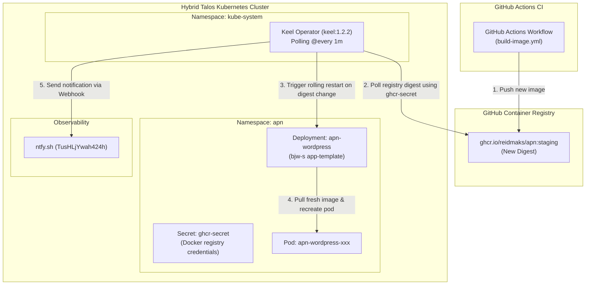

# 026 Automated Workload Updates via Keel

**Status:** Proposed / Ready for Apply
**Date:** 2026-09-25

## Context

Application container images (such as `ghcr.io/reidmaks/apn:staging`) are built and pushed to GitHub Container Registry (GHCR) via GitHub Actions CI workflows.

In Kubernetes, setting `imagePullPolicy: Always` ensures that new pods pull the latest image upon creation, but Kubernetes does not actively monitor container registries for digest changes on mutable tags (`staging`, `latest`). Without an external trigger or controller, the running pods remain on the old image digest indefinitely until a manual `kubectl rollout restart` is performed.

To achieve hands-off continuous delivery for `apn` (and future applications) without the substantial memory footprint of full GitOps suites like ArgoCD, we deploy **Keel** as an in-cluster image update operator.

## Architecture & Topology



## Architectural Decisions

### 1. Choice of Controller: Keel vs. ArgoCD vs. Push Webhook
- **ArgoCD + Image Updater:** Rejected for this use case due to resource constraints (~500MB–1.2GB RAM across 5+ pods) and conflict with our "Terraform for everything" workload management model.
- **Push Webhook:** Highly efficient, but requires exposing a dedicated webhook receiver endpoint to the public Internet and maintaining deploy secrets across external GitHub repositories.
- **Keel:** Selected because it is extremely lightweight (~30–50MB RAM), runs entirely inside the cluster, natively handles both semver and digest-based updates on mutable tags (`staging`, `latest`), and can be adopted across multiple namespaces simply via annotations.

### 2. Registry Authentication
Keel utilizes the workload's existing registry credentials:
- Deployment annotation `keel.sh/imagePullSecret: "ghcr-secret"` instructs Keel to read the credentials from `apn/ghcr-secret`.
- Keel's ClusterRole is granted `get`, `list`, `watch` on secrets cluster-wide to fetch authentication tokens dynamically for polling private and rate-limited registries.

### 3. Workload Policy Configuration
For mutable staging tags (`staging`), the following annotations are configured on `apn-wordpress`:
```yaml
annotations:
  keel.sh/policy: "force"            # Check SHA manifest digest changes on mutable tags
  keel.sh/trigger: "poll"            # Actively poll the remote registry
  keel.sh/matchTag: "true"           # Only redeploy if the incoming tag matches the configured tag
  keel.sh/match-tag: "true"          # Compatibility alias for legacy Keel versions
  keel.sh/pollSchedule: "@every 1m"  # Check GHCR every 1 minute
  keel.sh/imagePullSecret: "ghcr-secret"
```

### 4. Notifications
Keel utilizes its native **Webhook** notification sender (`WEBHOOK_ENDPOINT: "https://ntfy.sh/TusHLjYwah424h"`) to dispatch deployment notifications directly to the existing cluster `ntfy` topic.

> [!NOTE]
> Shoutrrr's `ntfy` service is disabled because Keel unconditionally sets `params.SetLevel(...)`, which is rejected as an invalid config key by Shoutrrr's ntfy configuration parser. Native Webhook delivers clean, reliable HTTP POSTs to ntfy without schema rejection.

## References
- [[025-apn-public-ingress-and-dns]]
- [[INDEX]]
