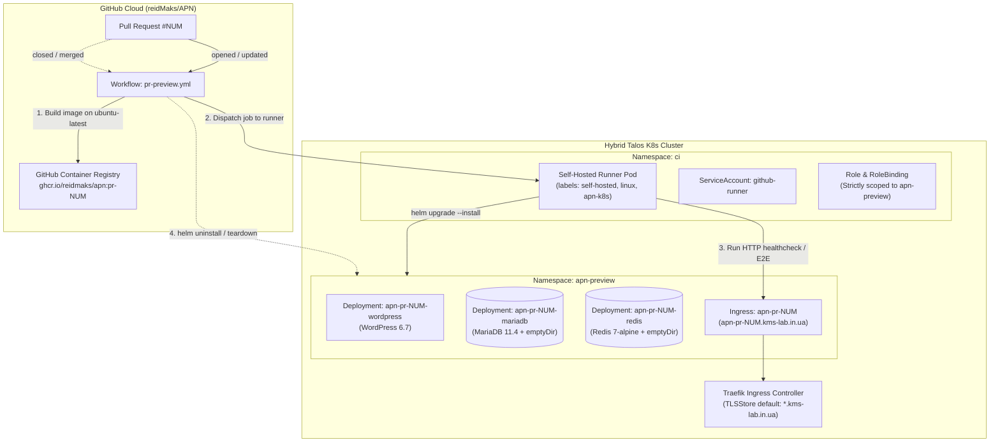

# 027 Self-Hosted GitHub Actions Runner & Ephemeral PR Preview Pods for APN

**Status:** Accepted / Ready for Apply
**Date:** 2026-09-27

## Context

The **APN** educational platform (`WordPress 6.7 + WooCommerce + TutorLMS + MariaDB`) requires continuous integration, smoke testing, and end-to-end (E2E) verification for Pull Requests without dirtying or risking the staging (`apn.kms-lab.in.ua`) or production environments.

Because the hybrid Talos Kubernetes cluster and the internal domain `*.kms-lab.in.ua` operate within a private Proxmox subnet (`192.168.0.0/24`) without exposed public router ports, standard GitHub-hosted cloud runners cannot reach cluster endpoints directly to deploy manifests or run tests against internal ingress URLs.

To resolve this limitation, we deploy an in-cluster self-hosted GitHub Actions runner paired with an ephemeral PR preview environment template.

## Architecture & Topology

## Key Architectural Decisions

### 1. Self-Hosted Runner Strategy (Deployment vs ARC)
- Rather than introducing the complexity, CRD overhead, and memory consumption (>500MB) of Actions Runner Controller (ARC) for a single repository, we deploy a lightweight, dedicated **Deployment** (`workload/ci_runner.tf`) in namespace `ci`.
- Deploys **2 replicas** (`replicas = 2`) with `topology_spread_constraint` across local AMD64 Proxmox worker nodes (`talos-f9o-10o` and `talos-wfh-33w`) to allow concurrent PR testing and eliminate queue delays.
- Uses `myoung34/github-runner:ubuntu-noble` with labels `[self-hosted, linux, apn-k8s, apn-runner]` and `RANDOM_RUNNER_SUFFIX = "true"` for independent runner registration.
- An `initContainer` (`alpine/helm:3.17.1`) downloads and mounts matching `kubectl` and `helm` binaries into `/tools`, prepended to `$PATH`. This avoids running root package managers inside the runner during job execution.

### 2. Principle of Least Privilege (PoLP) RBAC
- Security is critical: the runner pod must not possess cluster-admin privileges.
- The `github-runner` `ServiceAccount` in namespace `ci` is bound via `RoleBinding` to a `Role` strictly confined to the `apn-preview` namespace (`kubernetes_role.apn_preview_deployer`).
- The runner has complete CRUD permissions over Deployments, Pods, Services, Ingresses, Secrets, and ConfigMaps inside `apn-preview`, but zero access to `apn` (staging), `production`, `kube-system`, `default`, or `management`.

### 3. Ephemeral Storage (`emptyDir: {}`)
- Preview environments are short-lived (hours or days). Provisioning persistent distributed block volumes via Longhorn creates unnecessary storage attachment churn and volume fragmentation.
- Both `mariadb` data (`/var/lib/mysql`) and WordPress uploads (`/var/www/html/wp-content/uploads`) utilize `emptyDir: {}` volumes backed by local node disk/RAM.
- Upon PR closure or teardown, deleting the pod/namespace immediately reclaims 100% of the storage with zero Longhorn cleanup overhead.

### 4. Wildcard DNS & TLS Automation
- Traefik is already configured with `TLSStore default` holding the valid Let's Encrypt wildcard certificate `kms-lab-tls` for `*.kms-lab.in.ua` (managed by `cert-manager` via Cloudflare DNS-01 challenges, see [[002-networking-and-ingress]]).
- All preview hostnames matching `apn-pr-*.kms-lab.in.ua` automatically inherit valid HTTPS termination with zero additional ACME requests or Cloudflare API rate-limit consumption.

### 5. Multi-Arch Hybrid Build Segregation
- **Heavy lifting (Docker buildx)**: Executes on GitHub-hosted `ubuntu-latest` runners to conserve home server CPU/thermal cycles.
- **Cluster operations (deploy, rollout, E2E tests)**: Executes on the in-cluster `apn-k8s` self-hosted runner scheduled on local AMD64 worker nodes (`talos-f9o-10o` / `talos-wfh-33w`).

### 6. Automated Teardown
- The CI workflow triggers on `pull_request: [closed]`.
- Executes `helm uninstall apn-pr-<NUM> -n apn-preview --wait` and purges any residual labeled resources, ensuring zero resource leaks in the cluster.

## Related Documents
- [[001-hybrid-cluster]] - Hybrid Talos Kubernetes Cluster
- [[002-networking-and-ingress]] - Networking, Ingress, WG Hub, and Cloudflare
- [[025-apn-public-ingress-and-dns]] - Production Public Ingress, TLS, and DNS for APN Educational Platform
- [[026-keel-image-automation]] - Automated Workload Updates via Keel
- [[029-apn-performance-optimization-redis-mariadb]] - APN Performance Optimization: Persistent Object Cache & MariaDB Tuning
