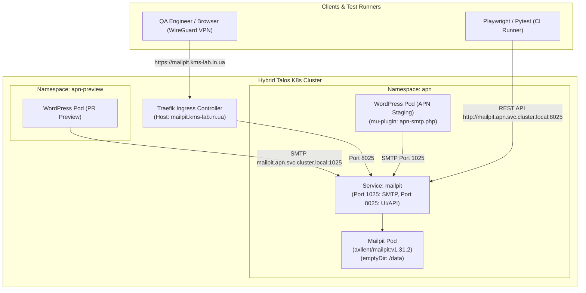

# 028 Mailpit SMTP Catcher and Email Testing Service

**Status:** Accepted / Ready for Apply
**Date:** 2026-09-28

## Context

The **APN** educational platform (`WordPress 6.7 + WooCommerce + TutorLMS + MariaDB`) generates transactional emails for:
1. Student account registration and password resets.
2. WooCommerce purchase confirmations and BACS payment requisites.
3. Tutor LMS course/webinar enrollment and lesson notifications.

During local testing on Staging (`https://apn.kms-lab.in.ua`) and ephemeral PR preview pods (`https://apn-pr-*.kms-lab.in.ua`), real emails must never be sent to external addresses to prevent data leaks. Furthermore, automated E2E tests (Playwright, Pytest) and QA engineers need a reliable, fast SMTP sink with a web UI and REST API to inspect message bodies, verify links, and assert transactional workflows.

## Decision

We deploy **Mailpit** (`axllent/mailpit:v1.31.2`) in the `apn` namespace as a lightweight, zero-dependency SMTP server and email inspection tool.

### 1. Zero-Disk Ephemeral Storage (`emptyDir`)
- As test emails and PR preview verification logs do not require long-term persistence across pod restarts, Mailpit uses an ephemeral `emptyDir: {}` volume mounted at `/data` (`MP_DATABASE=/data/mailpit.db`).
- This avoids unnecessary block allocation and replication overhead on Longhorn distributed storage (`0 MB Longhorn PVC allocated`).
- An automatic FIFO purge is configured via `MP_MAX_MESSAGES=500` to prevent memory/scratch disk growth.

### 2. Network Topology & Ingress
- **SMTP Server**: Exposed internally via Kubernetes Service `mailpit` on TCP port `1025` (`mailpit.apn.svc.cluster.local:1025`).
  - Pods in namespace `apn` connect directly via `mailpit:1025` or `mailpit.apn.svc.cluster.local:1025` without authentication or TLS.
  - Ephemeral PR preview pods in `apn-preview` connect across namespaces via `mailpit.apn.svc.cluster.local:1025`.
- **Web UI & REST API**: Exposed on TCP port `8025` via Traefik Ingress:
  - Host: `mailpit.kms-lab.in.ua`
  - Ingress Class: `traefik`
  - TLS: Inherits cluster wildcard certificate `kms-lab-tls` (`*.kms-lab.in.ua`) via `traefik-system` default `TLSStore`.
  - Access Control: Resolves to `10.9.0.1` via Cloudflare wildcard DNS, ensuring access is strictly restricted to internal LAN and WireGuard VPN users.

### 3. Monitoring
- Ingress is annotated with `gatus.io/status: "[STATUS] == 200"` for automatic endpoint discovery by Gatus uptime monitoring.

## Architecture & Topology

## Consequences

- **Positive:** Fast, lightweight (<30MB RAM), zero Longhorn disk allocation, full REST API for automated Playwright testing.
- **Positive:** Secure by default — accessible only via VPN/LAN, with automatic wildcard TLS.
- **Consideration:** Emails are purged on pod recreation, which is intentional for test environments.

## Related Documents
- [[002-networking-and-ingress]] - Networking, Ingress, and TLSStore
- [[010-gatus-auto-discovery]] - Gatus Monitoring Auto-Discovery
- [[025-apn-public-ingress-and-dns]] - APN Ingress and DNS
- [[027-apn-pr-preview-and-ci-runner]] - APN Ephemeral PR Previews and CI Runner
