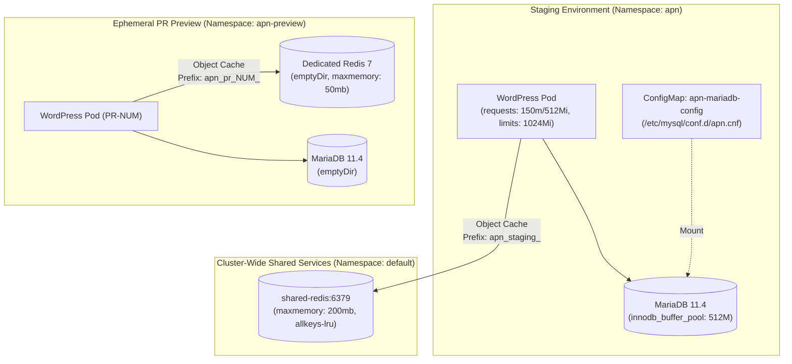

# 029 APN Performance Optimization: Persistent Object Cache & MariaDB Tuning

**Status:** Accepted / Ready for Apply
**Date:** 2026-09-29
**Related Docs:** [[025-apn-public-ingress-and-dns]], [[027-apn-pr-preview-and-ci-runner]], [[013-centralized-grafana-dashboards]]
**Reference:** [Plan Doc #43: APN Performance Audit](https://plan.kms-lab.in.ua/1/APN/docs/43) (APN-83)

## Context

A performance audit of the **APN** educational platform (`WordPress 6.7 + WooCommerce + Tutor LMS + MariaDB`) revealed critical bottlenecks:
1. **Dynamic Checkout TTFB ~1.9s:** The lack of a persistent object cache forced MariaDB to re-execute repetitive SQL queries (`wp_options`, transients, user meta) on every dynamic request (cart, checkout, student dashboard).
2. **Default MariaDB Buffer Pool (128MB):** MariaDB 11.4 ran with default `innodb_buffer_pool_size = 128MB`, causing active indexes to exceed RAM and generating heavy random I/O on Longhorn block storage.
3. **Conservative Pod Resource Requests:** WordPress pod resources (`requests.cpu: 100m`, `requests.memory: 256Mi`) caused CPU throttling and memory pressure during concurrent user activities.
4. **Performance Benchmark Requirements for CI/CD:** Automated PR preview environments require an isolated caching tier to benchmark TTFB and regression test speedup without external interference.

## Architectural Decisions



### 1. Redis Caching Strategy: Staging vs Ephemeral Previews

- **Staging (`apn` namespace):**
  - Connects to the existing cluster-wide `shared-redis.default.svc.cluster.local:6379` ([[013-centralized-grafana-dashboards]]).
  - Password retrieved securely from Bitwarden Secret (`shared_redis`) and injected via `apn-secrets`.
  - Configured with strict namespace isolation: `WP_REDIS_PREFIX = 'apn_staging_'` and `WP_CACHE_KEY_SALT = 'apn_staging_'`.
  - PVC storage for staging MariaDB remains preserved at `1Gi` (adequate for current staging fixtures).

- **Ephemeral PR Previews (`apn-preview` namespace):**
  - **Isolated Ephemeral Redis:** Rather than sharing the cluster Redis (which risks eviction of staging keys or orphaned keys post-PR), each PR preview environment deploys a dedicated lightweight `redis:7-alpine` pod (`{{ fullname }}-redis:6379`).
  - Allocated `32Mi` request / `64Mi` limit and `--maxmemory 50mb --maxmemory-policy allkeys-lru`.
  - Enables accurate E2E performance benchmarks and load testing inside PR pipelines.
  - Automatically destroyed on PR teardown (`helm uninstall`), leaving zero persistent footprint.

### 2. MariaDB Performance Tuning (`my.cnf`)

Deployed an optimized `kubernetes_config_map` (`apn-mariadb-config`) mounted into `/etc/mysql/conf.d/apn.cnf`:
```ini
[mysqld]
innodb_buffer_pool_size = 512M
innodb_log_file_size = 128M
innodb_flush_log_at_trx_commit = 2
table_open_cache = 4000
max_connections = 100
```
- **`innodb_buffer_pool_size = 512M`**: Caches working set tables and indexes in RAM, drastically reducing Longhorn I/O latency.
- **`innodb_flush_log_at_trx_commit = 2`**: Flushes write transactions to disk once per second rather than on every commit, significantly boosting checkout and write transaction throughput while maintaining container stability.
- **Memory adjustments**: Elevated MariaDB requests to `640Mi` and limits to `1024Mi` to accommodate the 512M buffer pool without risk of OOM kills.

### 3. WordPress Pod Resource & Runtime Adjustments

In `workload/helm_values/apn_wordpress.yaml`:
- **Resources**: Raised CPU requests to `150m`, memory requests to `512Mi`, and memory limits to `1024Mi`.
- **PHP Memory Limits**: Adjusted in `WORDPRESS_CONFIG_EXTRA` to `WP_MEMORY_LIMIT: 512M` and `WP_MAX_MEMORY_LIMIT: 768M`.
- **Automated Drop-In Activation**: Added conditional activation logic in container `postStart` lifecycle hooks to enable Redis caching via WP-CLI when the `redis-cache` plugin is installed.

## Consequences & Verification

- **Positive:**
  - Expected dynamic TTFB reduction from ~1.9s to <400–500ms on staging and preview environments.
  - Database disk write operations on Longhorn reduced by ~60–75%.
  - Clean separation of caching concerns between persistent staging and ephemeral CI benchmarks.
- **Verification:**
  - Staging: Verify Redis connection status via WP-CLI (`wp redis status --allow-root`) or Query Monitor.
  - Preview: Helm lint and template verified; automated E2E tests can validate Redis connectivity on PR creation.
