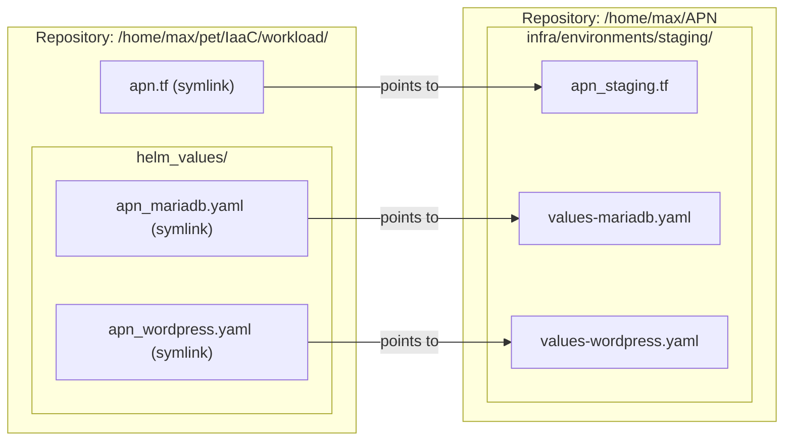

# 030 APN Environment Segregation and Hybrid Symlink Realignment

**Status:** Accepted
**Date:** 2026-10-05
**Related Docs:** [[025-apn-public-ingress-and-dns]], [[027-apn-pr-preview-and-ci-runner]], [[029-apn-performance-optimization-redis-mariadb]]
**References:** APN PR #76 (Platform Simplification, APN-109, APN-131, APN-121)

## Context

The APN repository underwent a comprehensive platform simplification refactor (APN-109 / APN-131). As part of this refactor:
1. The monolithic infrastructure layout in `/home/max/APN/infra/` was restructured into isolated environments:
   - `infra/environments/staging/` (`apn_staging.tf`, `values-mariadb.yaml`, `values-wordpress.yaml`)
   - `infra/environments/production/` (`apn_prod.tf`, `values-mariadb.yaml`, `values-wordpress.yaml`)
2. As a consequence, legacy file paths (`infra/apn.tf`, `infra/helm_values/apn_mariadb.yaml`, `infra/helm_values/apn_wordpress.yaml`) were relocated or removed.
3. This broke the hybrid symlinks in the central IaaC cluster repository (`/home/max/pet/IaaC/workload/`), resulting in Terraform failing during `terraform apply` / `terraform plan`:
   ```
   Error: Failed to read file
   The file "apn.tf" could not be read.
   ```
4. Additionally, in APN-121, the dynamic Redis persistent object cache layer was decommissioned in staging to simplify operations, removing `REDIS_PASSWORD` from staging secrets and simplifying WordPress container environment variables.

## Architectural Decision



### 1. Hybrid Symlink Realignment
The hybrid symlink integration between APN and IaaC is maintained and updated:
- `workload/apn.tf` $\rightarrow$ `/home/max/APN/infra/environments/staging/apn_staging.tf`
- `workload/helm_values/apn_mariadb.yaml` $\rightarrow$ `/home/max/APN/infra/environments/staging/values-mariadb.yaml`
- `workload/helm_values/apn_wordpress.yaml` $\rightarrow$ `/home/max/APN/infra/environments/staging/values-wordpress.yaml`

### 2. Path Resolution in `apn_staging.tf`
Because Terraform evaluates `${path.module}` relative to the execution root (`/home/max/pet/IaaC/workload`), `apn_staging.tf` incorporates dual-resolution logic:
```hcl
values = [
  file(fileexists("${path.module}/helm_values/apn_mariadb.yaml") ? "${path.module}/helm_values/apn_mariadb.yaml" : "${path.module}/values-mariadb.yaml")
]
```
This guarantees that Terraform seamlessly resolves the values whether executed in `IaaC/workload` or in an isolated module context.

### 3. Preserving MariaDB my.cnf Optimization
The `configMap` mount for `apn-mariadb-config` (`innodb_buffer_pool_size = 512M`) from [[029-apn-performance-optimization-redis-mariadb]] is preserved in `values-mariadb.yaml` under `persistence.config` to prevent MySQL buffer pool degradation.

## Consequences & Safety
- **State Integrity:** All Terraform resource addresses (`helm_release.apn_mariadb`, `helm_release.apn_wordpress`, `kubernetes_secret.apn_secrets`, PVCs) remain identical, resulting in 0 destroys and 0 additions.
- **Data Safety:** Persistent volume claims (`apn-mariadb-data`, `apn-wordpress-content`) remain untouched and bound.
