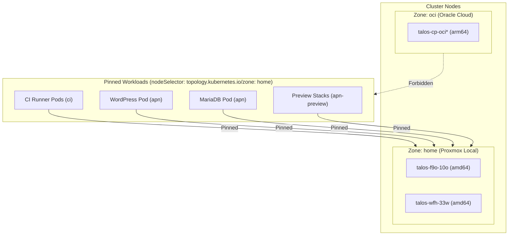

# 031 Pin APN Staging, Preview, and CI Runners to Home Zone

**Status:** Accepted
**Date:** 2026-10-05
**Related Docs:** [[001-hybrid-cluster]], [[021-esphome-home-zone-pinning]], [[027-apn-pr-preview-and-ci-runner]], [[030-apn-environment-segregation-and-symlinks]]

## Context

In our hybrid Talos Kubernetes cluster:
- Local Proxmox worker nodes (`talos-f9o-10o`, `talos-wfh-33w`) carry the label `topology.kubernetes.io/zone=home`.
- Oracle Cloud control-plane / remote nodes carry the label `topology.kubernetes.io/zone=oci`.

Without explicit zone constraints, the Kubernetes scheduler scheduled the Staging MariaDB pod (`apn-mariadb`) onto `talos-cp-oci` (an OCI remote node). This caused database I/O to travel over the WireGuard cross-cloud tunnel to access Longhorn persistent volumes attached at home, increasing latency and creating fragility.

Furthermore, ephemeral PR preview environments (`apn-preview`) and GitHub Actions runners (`ci/apn-github-runner`) should never run on shared OCI nodes, but rather remain strictly on local bare-metal worker hardware with high CPU/disk I/O and zero WAN egress costs.

## Architectural Decision

Pin all non-production APN workloads strictly to the home zone using hard `nodeSelector` constraints:



### 1. GitHub Actions Runner (`workload/ci_runner.tf`)
Added `topology.kubernetes.io/zone = "home"` alongside `"kubernetes.io/arch" = "amd64"`:
```hcl
node_selector = {
  "topology.kubernetes.io/zone" = "home"
  "kubernetes.io/arch"          = "amd64"
}
```

### 2. APN Staging (`infra/environments/staging/`)
- `values-mariadb.yaml`:
  ```yaml
  controllers:
    main:
      pod:
        nodeSelector:
          topology.kubernetes.io/zone: home
  ```
- `values-wordpress.yaml`:
  ```yaml
  controllers:
    main:
      pod:
        nodeSelector:
          topology.kubernetes.io/zone: home
  ```

### 3. APN Preview Helm Chart (`deploy/preview/` and `workload/charts/apn-preview/`)
Added `nodeSelector` to `templates/wordpress.yaml`, `templates/mariadb.yaml`, and `templates/redis.yaml`:
```yaml
spec:
  nodeSelector:
    topology.kubernetes.io/zone: home
```

## Consequences & Safety
- **Low Latency Database Access:** `apn-mariadb` always runs co-located on home LAN nodes with Longhorn storage replicas.
- **Egress & Cost Protection:** CI builds, database snapshots, and heavy Playwright E2E browser tests run on home hardware without incurring OCI network transfer or CPU contention.
- **Resilience:** If local nodes are down, staging/preview workloads remain unscheduled rather than spilling over to OCI control-plane nodes.
