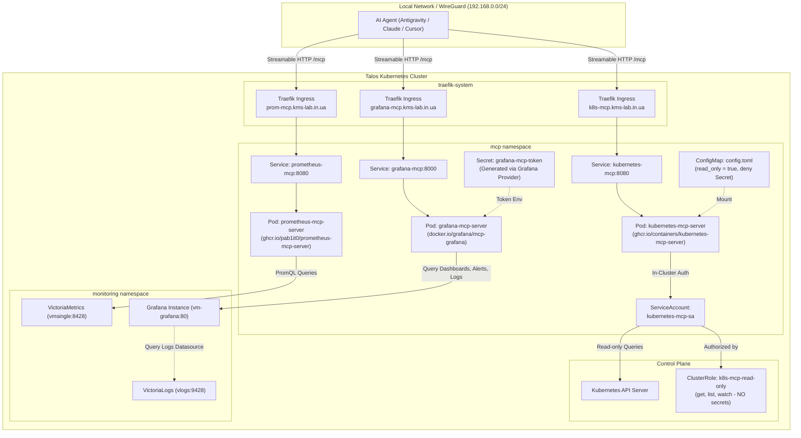

# ADR 032: In-Cluster Remote MCP Servers for Network AI Agents

## Status
Accepted

## Context
AI agents operating on the local network (such as Antigravity, Claude Code, Cursor, or automated scripts) require visibility into the Kubernetes cluster state (e.g., inspecting pods, deployments, logs, events, and resource metrics) to troubleshoot workloads and assist with operations.

Previously, ADR [[014-mcp-tool-server]] introduced `MCPO` (MCP-to-OpenAPI proxy) specifically to adapt stdio-based MCP servers into OpenAPI endpoints for Open WebUI. However:
1. `MCPO` had high runtime overhead (downloading `kubectl` and multiple npm packages at startup via `npx`, consuming 600Mi–1.5Gi RAM and causing CPU spikes).
2. Open WebUI and MCPO have since been scaled to zero replicas.
3. Modern AI agents natively support the Model Context Protocol over HTTP (SSE / Streamable HTTP) and do not need an OpenAPI translation layer.
4. Security requirement: External agents must not store administrative `kubeconfig` files or cluster bearer tokens. All authentication, authorization, and RBAC enforcement must remain strictly in-cluster.

## Decision

1. **Dedicated Kubernetes Namespace**:
   All in-cluster MCP tool servers are isolated in the `mcp` namespace.

2. **Terraform Modularization**:
   All MCP resources are organized into a local Terraform module in [`workload/mcp/`](../../workload/mcp/) and referenced from [`workload/mcp.tf`](../../workload/mcp.tf). Additional MCP servers (such as Prometheus or databases) will each be deployed as independent files within this module.

3. **Separate Container per MCP Server (Microservice Architecture)**:
   Rather than bundling multiple tools into a monolithic container, each MCP tool is deployed as an independent Deployment and Service. This isolates failure domains, prevents credential leakage across tools, and keeps container images minimal.

4. **Native Go Kubernetes MCP Server**:
   We deploy `ghcr.io/containers/kubernetes-mcp-server` (developed by the containers/Red Hat ecosystem):
   - Native Go binary with direct `client-go` in-cluster authentication.
   - Streamable HTTP mode on port `8080` (endpoint `/mcp`).
   - Separate health and metrics server on port `8081` (`/healthz`).
   - Memory footprint is lightweight (~20–50Mi steady state) with fast startup.

5. **Defense-in-Depth RBAC & Secret Protection**:
   - The Pod runs under `ServiceAccount` `kubernetes-mcp-sa`.
   - Bound to `ClusterRole` `k8s-mcp-read-only` which restricts actions strictly to `get`, `list`, `watch`.
   - **Secret Protection**: `secrets` are intentionally excluded from the RBAC `ClusterRole`. Additionally, the server's `config.toml` explicitly declares `[[denied_resources]]` for `Secret` objects and sets `read_only = true`.

6. **Prometheus MCP Server**:
   We deploy `ghcr.io/pab1it0/prometheus-mcp-server` for querying Prometheus/VictoriaMetrics:
   - Configured with `PROMETHEUS_MCP_SERVER_TRANSPORT=http` (FastMCP Streamable HTTP) listening on port `8080` (endpoint `/mcp`).
   - Liveness/readiness probe on `/health`.
   - Connected directly to internal VictoriaMetrics endpoint: `http://vmsingle-vm-victoria-metrics-k8s-stack.monitoring.svc.cluster.local:8428`.
   - Zero Kubernetes API access needed (`automount_service_account_token = false`).
   - Exposed via Traefik Ingress at `prom-mcp.kms-lab.in.ua`.

7. **Grafana MCP Server**:
   We deploy `docker.io/grafana/mcp-grafana:latest` for querying Grafana dashboards, panels, datasources (including VictoriaLogs for log exploration), and alerts:
   - Configured with `-t streamable-http`, `-allowed-hosts *`, and `-allowed-origins *` listening on port `8000` (endpoint `/mcp`). Host/Origin validation is delegated to Traefik Ingress.
   - Liveness and readiness probes using `tcp_socket` on port `8000`.
   - **Automated Service Account Provisioning**: Managed completely in Terraform using the official `grafana/grafana` provider. Terraform authenticates with Grafana using the existing Bitwarden admin password, creates a Service Account with the `Viewer` role, generates a token, and injects it into a Kubernetes Secret (`grafana-mcp-token`) in the `mcp` namespace.
   - Connected directly to internal Grafana: `http://vm-grafana.monitoring.svc.cluster.local:80`.
   - Exposed via Traefik Ingress at `grafana-mcp.kms-lab.in.ua`.

8. **Unified Streamable HTTP Transport**:
   All in-cluster MCP servers implement the modern Streamable HTTP protocol over `/mcp`. This allows MCP clients (such as Antigravity, Claude Code, Cursor) to connect directly via simple `"url"` fields without requiring external stdio bridge utilities like `mcp-remote`.

9. **Network Exposure & Routing**:
   - Exposed via Traefik Ingress (`k8s-mcp.kms-lab.in.ua`, `prom-mcp.kms-lab.in.ua`, `grafana-mcp.kms-lab.in.ua`).
   - Internal DNS resolution routes wildcard `*.kms-lab.in.ua` to the WireGuard / LAN gateway (`10.9.0.1` / `192.168.0.0/24`), ensuring endpoints are reachable only from the local network and VPN.

## Architecture Diagram



## Consequences

### Positive
- **Zero Client Credentials & No Node.js Bridge**: External agents do not need `kubectl`, `kubeconfig`, tokens, or `mcp-remote` node wrappers. Simple `"url": "http://.../mcp"` works out of the box.
- **Strict Read-Only Enforcement**: Dual-layer protection (RBAC + application-level config) prevents accidental or malicious state changes and blocks access to secrets.
- **Isolated Failure Domains**: The Kubernetes MCP, Prometheus MCP, and Grafana MCP run in separate Pods with separate resource boundaries and independent lifecycles.
- **Full Observability for AI Agents**: Agents have comprehensive visibility across cluster workloads (K8s API), metrics (VictoriaMetrics PromQL), and historical logs/dashboards (Grafana Explore / VictoriaLogs).
- **Fully Automated Lifecycle**: Service Account creation, token generation, secret creation, and pod mounting are 100% managed via Terraform.

### Client Configuration
To connect an AI assistant or MCP client within the local network:

```json
{
  "mcpServers": {
    "kubernetes": {
      "url": "http://k8s-mcp.kms-lab.in.ua/mcp"
    },
    "prometheus": {
      "url": "http://prom-mcp.kms-lab.in.ua/mcp"
    },
    "grafana": {
      "url": "http://grafana-mcp.kms-lab.in.ua/mcp"
    }
  }
}
```
